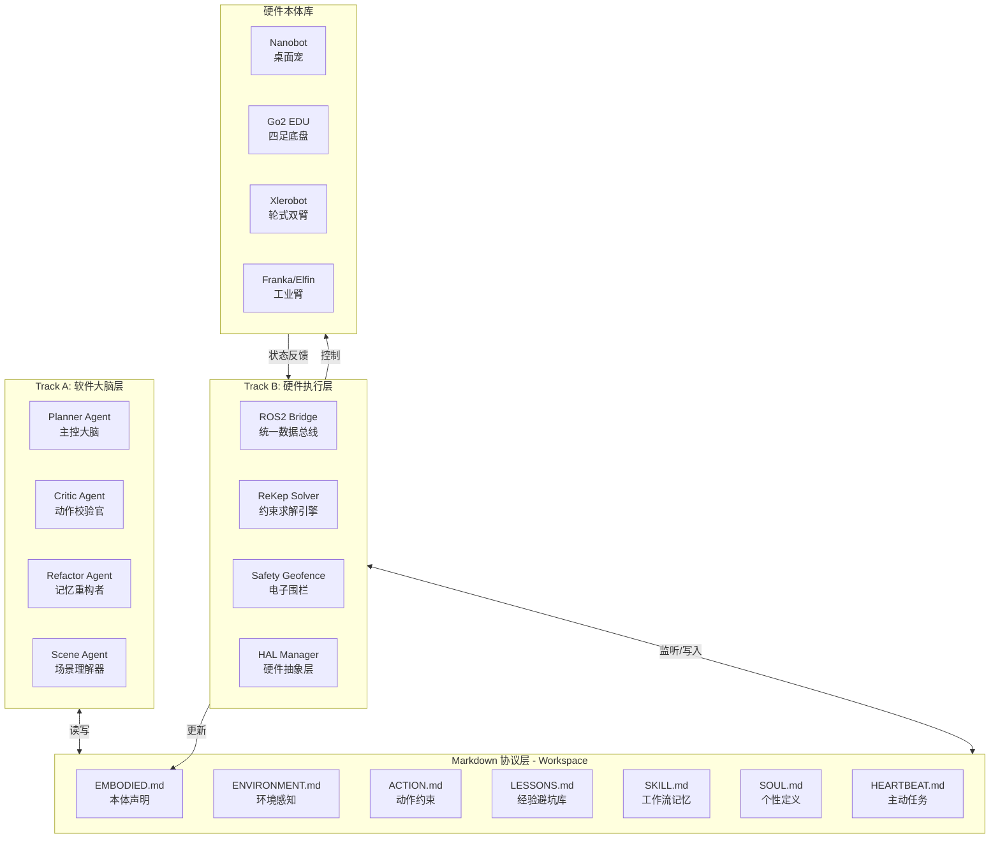
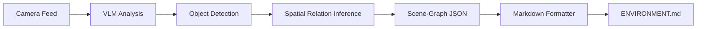
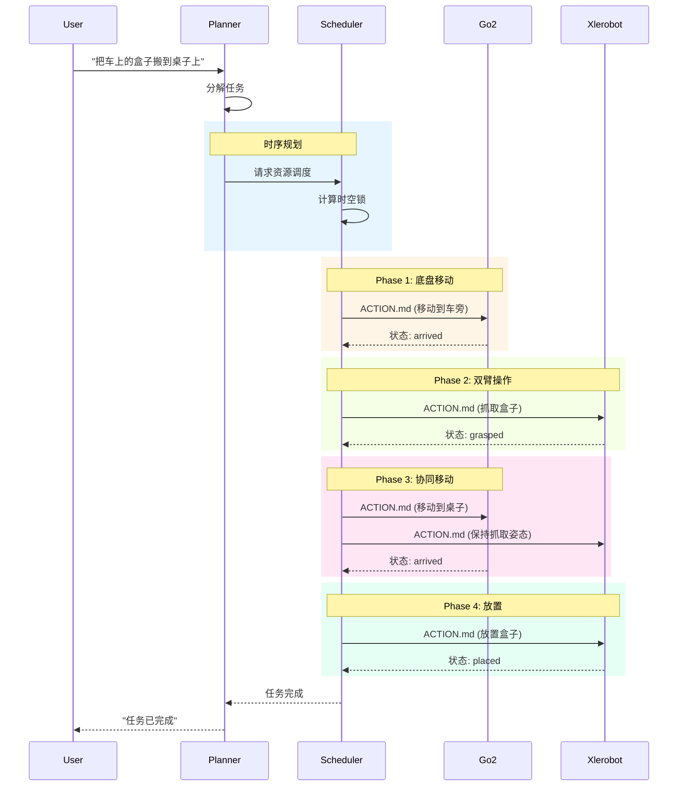
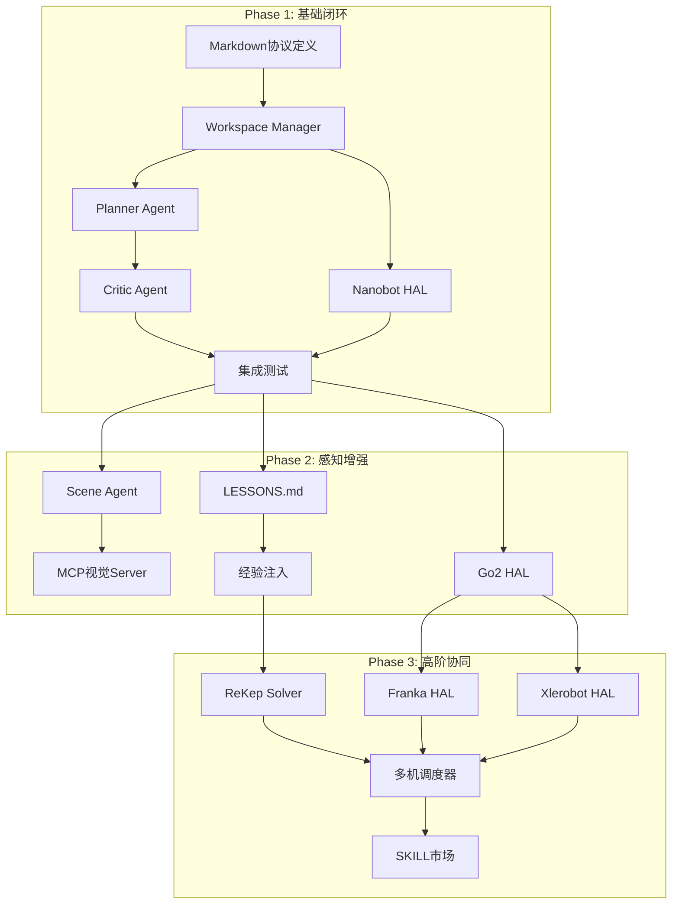

# OpenEmbodiedAgent 实现方案

> 基于 nanobot 的具身版 OpenClaw 实现路线图
> 版本: v1.0
> 日期: 2026-03-13

---

## 一、架构分析

### 1.1 nanobot 现有架构映射

| nanobot 组件 | 对应 OpenClaw Embodied 层级 | 功能描述 |
|-------------|---------------------------|---------|
| `nanobot/agent/loop.py` | Track A: 主控大脑 | ReAct 循环、工具调用执行 |
| `nanobot/agent/context.py` | 系统提示构建 | 加载 AGENTS.md/SOUL.md/USER.md/TOOLS.md |
| `nanobot/agent/skills.py` | Track A: 技能系统 | SKILL.md 加载与管理 |
| `nanobot/agent/memory.py` | Track A: 持久记忆 | MEMORY.md 记忆存储与检索 |
| `nanobot/heartbeat/service.py` | Track A: 主动服务 | 周期性任务检查与执行 |
| `nanobot/agent/tools/` | 工具层 | 文件操作、Shell、Web、MCP等 |
| `nanobot/channels/` | 输入/输出通道 | Telegram、Discord、微信等 |

### 1.2 核心设计理念对齐

**nanobot 设计原则**:
- 万物皆 Markdown (State-as-a-File)
- 轻量级、模块化、可扩展
- 通过文件系统进行状态管理
- Skills 系统实现能力扩展

**OpenClaw Embodied 核心需求**:
- 文件即状态协议 (Workspace API)
- 软硬解耦、Multi-Agent 校验
- Markdown 双轨多体系统
- 从 Tier 3 (Nanobot) 逆向打通到 Tier 1

**对齐结论**: nanobot 的架构与 OpenClaw Embodied 理念高度契合，具备良好的扩展基础。

---

## 二、扩展架构设计

### 2.1 整体架构图



### 2.2 新增核心模块

```
nanobot/
├── embodied/                 # [NEW] 具身智能核心模块
│   ├── __init__.py
│   ├── core/                 # 核心逻辑
│   │   ├── planner.py        # Planner Agent 实现
│   │   ├── critic.py         # Critic Agent 实现
│   │   ├── refactor.py       # Refactor Agent 实现
│   │   └── scene.py          # Scene Agent (VLM→SceneGraph)
│   ├── workspace/            # Markdown 协议管理
│   │   ├── __init__.py
│   │   ├── embodied_md.py    # EMBODIED.md 管理
│   │   ├── environment_md.py # ENVIRONMENT.md 管理
│   │   ├── action_md.py      # ACTION.md 管理
│   │   ├── lessons_md.py     # LESSONS.md 管理
│   │   └── validator.py      # 文件格式校验器
│   ├── hal/                  # 硬件抽象层
│   │   ├── __init__.py
│   │   ├── base.py           # HAL 基类
│   │   ├── nanobot_hal.py    # Nanobot 驱动
│   │   ├── ros2_bridge.py    # ROS2 统一接口
│   │   └── rekep/            # ReKep 约束求解
│   │       ├── __init__.py
│   │       ├── solver.py     # 约束求解器
│   │       └── geofence.py   # 电子围栏
│   └── tools/                # 具身专用工具
│       ├── embodied_tool.py  # 本体发现工具
│       ├── action_tool.py    # 动作执行工具
│       └── scene_tool.py     # 场景感知工具
├── skills/
│   └── embodied/             # [NEW] 具身技能包
│       ├── SKILL.md
│       ├── nanobot_basic/    # Nanobot 基础动作
│       ├── manipulation/     # 操作技能
│       └── navigation/       # 导航技能
```

---

## 三、Phase 1: 桌面闭环与 Markdown 协议确立

**目标**: 在最简化的 Nanobot 上跑通软硬解耦与 Multi-Agent 校验流
**时间**: Months 1-2

### 3.1 任务拆解

#### Track A 任务

| 任务ID | 任务描述 | 技术要点 | 输出物 |
|-------|---------|---------|-------|
| A1.1 | 定义 Markdown 协议格式 | 设计 EMBODIED.md/ENVIRONMENT.md/ACTION.md 的 Schema | `docs/protocol_v1.md` |
| A1.2 | 实现 Workspace Manager | 文件监听、校验、版本管理 | `nanobot/embodied/workspace/` |
| A1.3 | 开发 Planner Agent | 任务拆解、ACTION.md 生成 | `nanobot/embodied/core/planner.py` |
| A1.4 | 开发 Critic Agent | 物理极限校验、安全检查 | `nanobot/embodied/core/critic.py` |
| A1.5 | Multi-Agent 协调器 | Agent 间通信与状态流转 | `nanobot/embodied/core/orchestrator.py` |
| A1.6 | 集成到主循环 | 修改 `loop.py` 支持具身模式 | PR to `nanobot/agent/loop.py` |

#### Track B 任务

| 任务ID | 任务描述 | 技术要点 | 输出物 |
|-------|---------|---------|-------|
| B1.1 | Nanobot SDK 封装 | 串口/USB 通信协议 | `nanobot/embodied/hal/nanobot_hal.py` |
| B1.2 | HAL 基类设计 | 统一硬件接口抽象 | `nanobot/embodied/hal/base.py` |
| B1.3 | ACTION.md 监听器 | watchdog 文件监听执行 | `nanobot/embodied/hal/action_watcher.py` |
| B1.4 | 电机驱动实现 | 基础动作: 点头/摇头/指向 | `nanobot/embodied/hal/nanobot_driver.py` |
| B1.5 | 状态回传机制 | 执行结果写入 EMBODIED.md | `nanobot/embodied/hal/state_reporter.py` |

### 3.2 技术规范

#### EMBODIED.md 格式 (v1)

```markdown
# Embodied Self

## Device Info
- **Name**: Nanobot-001
- **Type**: nanobot_desktop_pet
- **Version**: v1.0
- **Status**: online

## Capabilities
- **Joints**: 3 (head_yaw, head_pitch, head_roll)
- **Degrees of Freedom**: 3
- **Sensors**: camera_1, mic_1
- **End Effectors**: none

## Joint Limits
| Joint | Min | Max | Default | Unit |
|-------|-----|-----|---------|------|
| head_yaw | -90 | 90 | 0 | deg |
| head_pitch | -45 | 45 | 0 | deg |
| head_roll | -30 | 30 | 0 | deg |

## Current State
- **head_yaw**: 15
- **head_pitch**: -5
- **head_roll**: 0
- **battery**: 85%
- **last_updated**: 2026-03-13T12:00:00Z
```

#### ENVIRONMENT.md 格式 (v1)

```markdown
# Environment Perception

## Scene Graph
- **Timestamp**: 2026-03-13T12:00:00Z
- **Camera**: camera_1 (1280x720)

### Objects
| ID | Type | Position | State | Relation |
|----|------|----------|-------|----------|
| obj_1 | cup | table_center | empty | on: table |
| obj_2 | laptop | table_left | open | near: cup |
| obj_3 | human | camera_front | sitting | facing: robot |

### Spatial Relations
- cup is "in front of" laptop
- human is "opposite to" robot
- table is "supporting" cup

## Safety Zones
- **Safe Operation Area**: 0.5m radius from robot base
- **Human Proximity**: 0.8m (safe)
```

#### ACTION.md 格式 (v1 - Nanobot 简化版)

```markdown
# Action Plan

## Metadata
- **Plan ID**: plan_20260313_001
- **Created By**: Planner-Agent-v1
- **Validated By**: Critic-Agent-v1
- **Timestamp**: 2026-03-13T12:00:00Z
- **Status**: pending → validated → executing → completed

## Task
"向左侧点头打招呼"

## Motion Sequence
| Step | Joint | Target | Duration | Easing |
|------|-------|--------|----------|--------|
| 1 | head_yaw | -30 | 500ms | ease_in_out |
| 2 | head_yaw | 0 | 500ms | ease_in_out |

## Safety Check
- [x] Within joint limits
- [x] No collision risk
- [x] Human in safe distance
```

### 3.3 里程碑验证

**测试场景**: 微信下发指令 -> Planner 生成动作 -> Critic 校验通过 -> Nanobot 完成点头

```bash
# 用户通过微信发送
"Nanobot，向左边点点头打招呼"

# 预期执行流程
1. [Channel] 微信消息 → InboundMessage
2. [Loop] AgentLoop 识别具身指令
3. [Planner] 生成 ACTION.md (点头动作序列)
4. [Critic] 校验关节限制、安全性 → 通过
5. [Workspace] ACTION.md 状态更新为 validated
6. [HAL Watcher] 检测到新动作
7. [Nanobot HAL] 执行电机指令
8. [State Reporter] 更新 EMBODIED.md 状态
9. [Channel] 返回执行结果到微信
```

---

## 四、Phase 2: 视觉解耦与工具链合并

**目标**: 接管真实环境感知，沉淀避坑经验库
**时间**: Months 3-4

### 4.1 任务拆解

#### Track A 任务

| 任务ID | 任务描述 | 技术要点 | 输出物 |
|-------|---------|---------|-------|
| A2.1 | Scene Agent 开发 | VLM → Scene-Graph 转换 | `nanobot/embodied/core/scene.py` |
| A2.2 | MCP 视觉 Server | 图像分析服务封装 | `mcp-servers/scene-perception/` |
| A2.3 | LESSONS.md 机制 | 失败记录与检索 | `nanobot/embodied/workspace/lessons_md.py` |
| A2.4 | 经验注入 Prompt | 将避坑经验加入上下文 | 修改 `context.py` |
| A2.5 | 技能学习系统 | 成功动作序列保存为 SKILL | `nanobot/embodied/core/skill_learner.py` |

#### Track B 任务

| 任务ID | 任务描述 | 技术要点 | 输出物 |
|-------|---------|---------|-------|
| B2.1 | Go2 ROS2 接口 | Unitree SDK 封装 | `nanobot/embodied/hal/go2_hal.py` |
| B2.2 | 底盘控制协议 | 移动、旋转、姿态控制 | `nanobot/embodied/hal/go2_driver.py` |
| B2.3 | LiDAR 数据解析 | 点云 → 障碍物检测 | `nanobot/embodied/hal/lidar_parser.py` |
| B2.4 | 多机发现机制 | 局域网设备自动发现 | `nanobot/embodied/hal/device_discovery.py` |

### 4.2 技术规范

#### Scene-Graph 生成流程



#### LESSONS.md 格式

```markdown
# Lessons Learned

## Failed: plan_20260313_005
- **Timestamp**: 2026-03-13T14:30:00Z
- **Task**: "把杯子放到桌子边缘"
- **Failure**: 杯子掉落
- **Root Cause**: 目标位置超出稳定支撑面
- **Lesson**: 放置物体时，目标位置需距离边缘 ≥5cm
- **Prevention**: 在 ACTION.md 生成时检查 "support_polygon"

## Failed: plan_20260313_008
- **Timestamp**: 2026-03-13T16:00:00Z
- **Task**: "快速转头看后方"
- **Failure**: 电机过流保护
- **Root Cause**: 角速度指令超出电机能力
- **Lesson**: head_yaw 角速度限制为 60deg/s
- **Prevention**: Critic Agent 校验 velocity limits
```

### 4.3 MCP 工具规范

#### 场景感知 MCP Server

```json
{
  "name": "scene-perception",
  "tools": [
    {
      "name": "capture_scene",
      "description": "Capture current camera view and generate scene graph",
      "parameters": {
        "camera_id": "string",
        "resolution": "string (optional)"
      }
    },
    {
      "name": "detect_objects",
      "description": "Detect specific objects in current scene",
      "parameters": {
        "object_types": ["string"],
        "confidence_threshold": "number"
      }
    },
    {
      "name": "measure_distance",
      "description": "Measure distance between two objects",
      "parameters": {
        "object_a": "string",
        "object_b": "string"
      }
    }
  ]
}
```

---

## 五、Phase 3: 约束求解与高阶异构协同

**目标**: 全面兼容工业级/科研级设备，展现 ReKep 求解与多机协同
**时间**: Months 5-6

### 5.1 任务拆解

#### Track B (核心发力)

| 任务ID | 任务描述 | 技术要点 | 输出物 |
|-------|---------|---------|-------|
| B3.1 | ReKep C++ Solver | 高性能约束求解器 | `native/rekep_solver/` |
| B3.2 | Franka FCI 接口 | 力控臂 SDK 封装 | `nanobot/embodied/hal/franka_hal.py` |
| B3.3 | Xlerobot 接口 | 轮式双臂 SDK 封装 | `nanobot/embodied/hal/xlerobot_hal.py` |
| B3.4 | 力矩安全监控 | 碰撞检测与熔断 | `nanobot/embodied/hal/safety_monitor.py` |
| B3.5 | 多机时间同步 | 分布式时钟同步 | `nanobot/embodied/hal/timesync.py` |

#### Track A 任务

| 任务ID | 任务描述 | 技术要点 | 输出物 |
|-------|---------|---------|-------|
| A3.1 | 多机调度器 | 任务分解与资源分配 | `nanobot/embodied/core/multi_robot_scheduler.py` |
| A3.2 | 时空锁机制 | 时间锁/空间锁实现 | `nanobot/embodied/workspace/action_md_v2.py` |
| A3.3 | ReKep 约束生成 | 自然语言 → 几何约束 | `nanobot/embodied/core/rekep_generator.py` |
| A3.4 | Refactor Agent | 夜间技能重构优化 | `nanobot/embodied/core/refactor.py` |
| A3.5 | SKILL 市场接口 | 技能上传/下载/评分 | `nanobot/embodied/core/skill_market.py` |

### 5.2 ReKep 约束格式

#### ACTION.md (v2 - ReKep 版)

```markdown
# Action Plan - ReKep Constraints

## Metadata
- **Plan ID**: plan_20260901_001
- **Robot**: Franka-001
- **End Effector**: gripper

## Task
"将杯子从桌面拿起放到架子上"

## Keyframes

### Keyframe 1: Approach
```yaml
constraints:
  - type: position
    target: cup_handle
    relation: "end_effector near target"
    tolerance: 0.05m
  - type: orientation
    target: cup_handle
    relation: "gripper_z aligns cup_axis"
    tolerance: 15deg
```

### Keyframe 2: Grasp
```yaml
constraints:
  - type: position
    target: cup_handle
    relation: "end_effector at target"
    tolerance: 0.005m
  - type: force
    condition: "gripper_closure"
    threshold: 5N
    action: "maintain_grasp"
```

### Keyframe 3: Transport
```yaml
constraints:
  - type: position
    path: "collision_free"
    waypoints: [wp_1, wp_2]
  - type: orientation
    condition: "cup_upright"
    priority: high
```

## Geofence
- **Workspace Bounds**: [[x1,y1,z1], [x2,y2,z2]]
- **No-Go Zones**: [zone_1, zone_2]
- **Force Limits**: {sustained: 50N, instantaneous: 100N}
```

### 5.3 多机协同调度



---

## 六、实施路径与依赖关系

### 6.1 模块依赖图



### 6.2 关键接口定义

#### HAL 基类接口

```python
# nanobot/embodied/hal/base.py

from abc import ABC, abstractmethod
from dataclasses import dataclass
from typing import Any, Callable

@dataclass
class RobotState:
    joint_positions: dict[str, float]
    joint_velocities: dict[str, float]
    end_effector_pose: dict[str, Any] | None
    battery_level: float
    is_moving: bool
    timestamp: str

@dataclass
class ActionResult:
    success: bool
    message: str
    final_state: RobotState | None
    execution_time_ms: int

class BaseHAL(ABC):
    """Hardware Abstraction Layer 基类"""
    
    @property
    @abstractmethod
    def device_type(self) -> str:
        """设备类型标识"""
        pass
    
    @property
    @abstractmethod
    def capabilities(self) -> dict[str, Any]:
        """返回设备能力描述"""
        pass
    
    @abstractmethod
    async def connect(self) -> bool:
        """建立与硬件的连接"""
        pass
    
    @abstractmethod
    async def disconnect(self) -> None:
        """断开连接"""
        pass
    
    @abstractmethod
    async def get_state(self) -> RobotState:
        """获取当前状态"""
        pass
    
    @abstractmethod
    async def execute_action(self, action: dict[str, Any]) -> ActionResult:
        """执行动作指令"""
        pass
    
    @abstractmethod
    def generate_embodied_md(self) -> str:
        """生成 EMBODIED.md 内容"""
        pass
    
    def set_state_callback(self, callback: Callable[[RobotState], None]) -> None:
        """设置状态变更回调"""
        self._state_callback = callback
```

#### Workspace 管理接口

```python
# nanobot/embodied/workspace/base.py

from pathlib import Path
from typing import Callable

class WorkspaceManager:
    """Markdown 协议文件管理器"""
    
    def __init__(self, workspace_path: Path):
        self.workspace = workspace_path
        self._watchers: dict[str, Callable] = {}
    
    def read_embodied(self) -> dict:
        """读取 EMBODIED.md"""
        pass
    
    def write_embodied(self, content: dict) -> None:
        """写入 EMBODIED.md"""
        pass
    
    def read_environment(self) -> dict:
        """读取 ENVIRONMENT.md"""
        pass
    
    def write_environment(self, content: dict) -> None:
        """写入 ENVIRONMENT.md"""
        pass
    
    def read_action(self) -> dict | None:
        """读取 ACTION.md"""
        pass
    
    def write_action(self, content: dict, validate: bool = True) -> None:
        """写入 ACTION.md，可选校验"""
        pass
    
    def update_action_status(self, status: str, message: str = "") -> None:
        """更新 ACTION.md 执行状态"""
        pass
    
    def append_lesson(self, lesson: dict) -> None:
        """追加经验教训到 LESSONS.md"""
        pass
    
    def read_lessons(self, limit: int = 10) -> list[dict]:
        """读取最近的教训"""
        pass
    
    def watch_action(self, callback: Callable[[dict], None]) -> None:
        """监听 ACTION.md 变化"""
        pass
```

---

## 七、风险评估与应对

### 7.1 技术风险

| 风险 | 可能性 | 影响 | 应对策略 |
|-----|-------|------|---------|
| ReKep 求解器性能不足 | 中 | 高 | 预留 PyBullet/Omniverse 备选方案 |
| 多机通信延迟 | 中 | 中 | 采用 ROS2 DDS，支持 QoS 配置 |
| VLM 场景理解不稳定 | 高 | 中 | 多模型投票 + 人工校验机制 |
| 硬件 SDK 兼容性 | 高 | 中 | 隔离 HAL 层，提供模拟模式 |

### 7.2 项目风险

| 风险 | 可能性 | 影响 | 应对策略 |
|-----|-------|------|---------|
| 开发周期超预期 | 中 | 高 | 每个 Phase 设置 MVP 检查点 |
| 团队分工接口不清 | 低 | 高 | 提前定义 Markdown 协议作为契约 |
| 硬件到位延迟 | 中 | 中 | 开发阶段使用 Gazebo 仿真 |

---

## 八、里程碑与验收标准

### 8.1 Phase 1 验收

**MVP 检查点**:
- [x] Markdown 协议文档 v1 发布
- [x] Workspace Manager 通过单元测试
- [x] Nanobot HAL 完成基础动作（点头/摇头）
- [x] Planner + Critic 双 Agent 跑通
- [x] 微信端到端演示成功

**性能指标**:
- 动作生成延迟 < 2s
- 端到端执行延迟 < 5s
- 文件系统监听延迟 < 100ms

### 8.2 Phase 2 验收

**MVP 检查点**:
- [x] Scene Agent 生成 Scene-Graph 准确率 > 80%
- [x] LESSONS.md 自动记录与检索
- [x] Go2 EDU 基础移动控制
- [x] 避障成功率 > 95%

**性能指标**:
- 场景理解延迟 < 3s
- MCP 视觉 Server 吞吐量 > 5 FPS
- 经验检索延迟 < 500ms

### 8.3 Phase 3 验收

**MVP 检查点**:
- [x] ReKep Solver 求解成功率 > 90%
- [x] Franka/Xlerobot 基础操作
- [x] 两车一臂协同演示
- [x] SKILL 市场上线

**性能指标**:
- 约束求解延迟 < 50ms
- 多机调度延迟 < 100ms
- 碰撞检测响应 < 10ms

---

## 九、附录

### 9.1 术语表

| 术语 | 定义 |
|-----|------|
| ReKep | Relational Keypoint Constraints，关系关键点约束，用于动作规划的几何约束表示方法 |
| HAL | Hardware Abstraction Layer，硬件抽象层 |
| Scene-Graph | 场景图，描述环境中物体及其空间关系的结构化表示 |
| Geofence | 电子围栏，定义机器人可活动空间的安全边界 |
| MCP | Model Context Protocol，模型上下文协议，用于工具集成的标准接口 |
| Tier | 用户/设备分层，Tier 3为消费级，Tier 1为科研级 |

### 9.2 参考文档

- nanobot README: `README_nanobot.md`
- OpenClaw Embodied 方案: `PROJ.md`
- ReKep 论文: https://rekep-robot.github.io/
- ROS2 Documentation: https://docs.ros.org/
- MCP Spec: https://modelcontextprotocol.io/

### 9.3 目录结构速查

```
/data0/chenweixing/projects/agent/OpenEmbodiedAgent/
├── PLAN.md                   # 本文件
├── README_nanobot.md         # nanobot 说明
├── PROJ.md                   # OpenClaw Embodied 方案
├── nanobot/                  # 现有代码库
│   ├── agent/
│   ├── channels/
│   ├── skills/
│   └── templates/
├── plans/                    # [可选] 详细子计划
└── docs/                     # [待创建] 详细文档
    ├── protocol_v1.md
    ├── hal_interface.md
    └── mcp_spec.md
```

---

*文档结束*