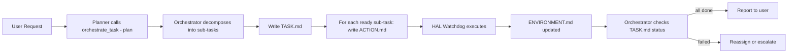

# Track 5: Multi-Agent Orchestrator — Task Coordination & Supervision

> Owner: TBD | Status: Planning | Priority: High

## 1. Objective

Build the **Orchestrator Agent** — a central coordinator that decomposes complex user requests into sub-tasks, assigns them to specific robot bodies, monitors execution progress, and handles failures. This is the "conductor" in a multi-robot orchestra.

## 2. Scope

### In Scope
- Design the `TASK.md` protocol for multi-step task decomposition
- Design the `ORCHESTRATOR.md` protocol for supervision and status tracking
- Implement `OrchestratorTool` as a new OEA tool that manages `TASK.md`
- Task lifecycle: `pending → assigned → in_progress → completed / failed`
- Multi-device coordination: time locks (sequential) and space locks (spatial exclusion)
- Failure recovery: re-assign failed sub-tasks or escalate to user
- Integration with existing Planner/Critic flow

### Out of Scope
- Hardware driver implementation (Tracks 1-4)
- Vision processing
- Memory persistence (Track 6)

## 3. Files to Create/Modify

| File | Action | Description |
|------|--------|-------------|
| `OEA/templates/TASK.md` | Create | Task decomposition and status template |
| `OEA/templates/ORCHESTRATOR.md` | Create | Orchestrator supervision state template |
| `OEA/agent/tools/orchestrator.py` | Create | `OrchestratorTool` for task management |
| `OEA/agent/loop.py` | Modify | Register OrchestratorTool |
| `tests/test_orchestrator_tool.py` | Create | Orchestrator logic tests |

## 4. TASK.md Protocol Specification

`TASK.md` holds the decomposed task tree. The Orchestrator Agent reads and writes this file.

```markdown
# Active Task

## Goal
Clean up the living room: pick up the apple from the floor and put it on the table.

## Sub-Tasks

| ID | Action | Target Device | Status | Depends On | Result |
|----|--------|--------------|--------|------------|--------|
| T1 | move_to floor area | go2_edu | completed | — | Arrived at floor area |
| T2 | detect apple | vision_server | completed | T1 | Apple at x=30 y=15 |
| T3 | pick_up apple | dobot_nova5 | in_progress | T2 | — |
| T4 | move_to table | dobot_nova5 | pending | T3 | — |
| T5 | put_down apple | dobot_nova5 | pending | T4 | — |

## Locks

- **Space Lock**: dobot_nova5 exclusive zone x=[20,40] y=[10,25] until T3 completes
- **Time Lock**: T4 must wait for T3 completion
```

## 5. ORCHESTRATOR.md Protocol Specification

`ORCHESTRATOR.md` is the Orchestrator's own state file, tracking the overall mission.

```markdown
# Orchestrator Status

## Current Mission
Clean up the living room

## Progress
3/5 sub-tasks completed (60%)

## Active Devices
- go2_edu: idle (completed T1)
- dobot_nova5: executing T3 (pick_up apple)
- vision_server: idle (completed T2)

## Issues
None

## Decision Log
- [15:30] Decomposed goal into 5 sub-tasks
- [15:31] Assigned T1 to go2_edu (nearest to floor area)
- [15:33] T1 completed, triggered T2
- [15:34] T2 completed, triggered T3
```

## 6. OrchestratorTool Interface

The `OrchestratorTool` is called by the Planner when it receives a complex multi-step request:

```python
# Tool schema (simplified)
{
    "name": "orchestrate_task",
    "parameters": {
        "goal": "string — the high-level user goal",
        "available_devices": "list — devices listed in EMBODIED.md",
        "operation": "string — 'plan' | 'check_status' | 'reassign' | 'cancel'"
    }
}
```

## 7. Task Lifecycle Flow



## 8. Milestones & Acceptance Criteria

### Milestone M1: Protocol Files
- [ ] `OEA/templates/TASK.md` exists with correct table columns (ID, Action, Device, Status, Depends On, Result)
- [ ] `OEA/templates/ORCHESTRATOR.md` exists with Progress %, Active Devices, Issues, Decision Log
- [ ] Both files auto-synced to workspace via `sync_workspace_templates()`
- [ ] `context.py` `EMBODIED_FILES` includes `TASK.md` and `ORCHESTRATOR.md`

### Milestone M2: OrchestratorTool Unit Tests
- [ ] `OrchestratorTool` registers in `OEA/agent/loop.py` without error
- [ ] `plan` operation writes valid `TASK.md` for a 3-step goal
- [ ] `check_status` reads `TASK.md` and returns correct progress % (e.g., 2/3 = 66%)
- [ ] Dependency order enforced: T4 stays `pending` while T3 is `in_progress`
- [ ] All unit tests pass with no hardware (mock only)

### Milestone M3: Single-Device Coordination
- [ ] 3-step task (move → pick → place) on one device → `TASK.md` shows 3 sub-tasks in order
- [ ] Each sub-task transitions `pending → in_progress → completed` in sequence
- [ ] Final state: `ORCHESTRATOR.md` shows 3/3 (100%)

### Milestone M4: Multi-Device Coordination (≥ 2 devices)
- [ ] 2 devices each get distinct sub-tasks with no overlap
- [ ] Space lock blocks second device from entering locked zone until first finishes
- [ ] One sub-task fails → Orchestrator logs in Decision Log and reassigns or escalates to user

### Milestone M5: End-to-End
- [ ] User types a complex multi-step request → Planner calls `orchestrate_task` → `TASK.md` created → all sub-tasks complete → user receives summary
- [ ] Single-device scenario works without orchestrator overhead (graceful degradation)

## 9. Dependencies

- Existing OEA Tool framework
- `EMBODIED.md` (to know available devices and capabilities)
- `ACTION.md` (to dispatch sub-tasks to HAL)
- `ENVIRONMENT.md` (to check task completion conditions)
